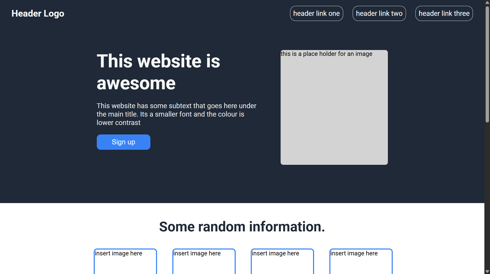
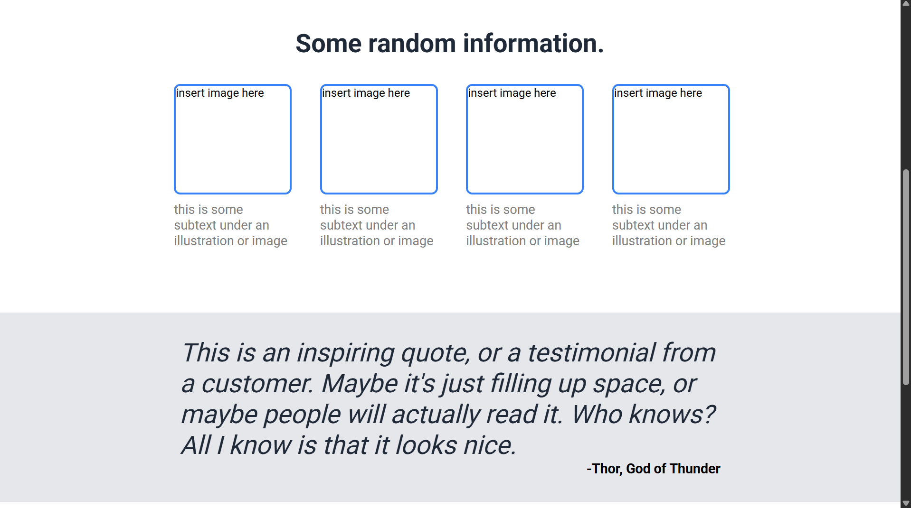

# Landing Page Project

This is a project built as part of the [Foundations course](https://www.theodinproject.com/lessons/foundations-landing-page) from [The Odin Project](https://www.theodinproject.com/).

## 📄 Project Overview

The objective of this project was to build a landing page from scratch based on a provided design. The main purpose was to practice:

- Semantic HTML structure
- Flexbox layout techniques
- CSS styling (typography, spacing, visual hierarchy)

## 🔗 Live Demo

👉 [click here](https://piyushb-27.github.io/landing-page/)

## 📸 Screenshot

*Desktop view*

## 🧰 Technologies Used

- HTML
- CSS  
- Flexbox  

## 🧱 Page Structure

The landing page is divided into the following sections:

1. **Header** – Contains the logo and navigation links
2. **Hero Section** – Main title, description, CTA button, and placeholder image
3. **Information Section** – Four info blocks with images and subtext
4. **Quote Section** – Testimonial-style quote with citation
5. **Call to Action** – Prompt to sign up with a styled button
6. **Footer** – Copyright information

## ✅ Features Implemented

- Responsive layout using Flexbox  
- Matching color palette and fonts based on design spec  
- Semantic HTML elements for better structure and accessibility  
- CSS buttons and text styling  
- Clean layout with consistent spacing  
## 📝 Lessons Learned

- Mastered **Flexbox** for layout and alignment  
- Understood the value of **semantic tags** in HTML  
- Practiced writing **modular, maintainable CSS**  
- Developed attention to **spacing, colors, and visual balance**  

---

## 🙏 Acknowledgements

- [The Odin Project](https://www.theodinproject.com/) for providing the design and detailed project instructions.
